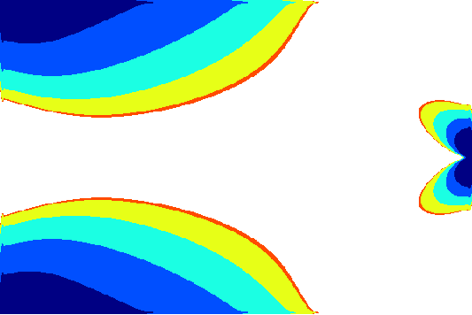
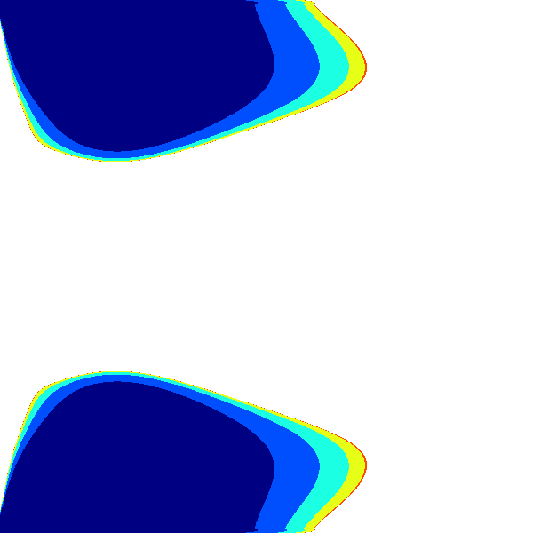

# Discrete Variable Topology Optimization Using Multi-Cut Formulation and Adaptive Trust Regions

Reference: [Ye, Zisheng and Pan, Wenxiao, "Discrete Variable Topology Optimization Using Multi-Cut Formulation and Adaptive Trust Regions", (2025)](https://link.springer.com/article/10.1007/s00158-025-03961-9)

# Gallery

## 2D Cantilever

|                         **Baseline (SIMP, 150 steps)**                         |                            **Single Material**                             |                            **Five Material**                             |
| :----------------------------------------------------------------------------: | :------------------------------------------------------------------------: | :----------------------------------------------------------------------: |
|  |  |  |

## 2D Inverter

|                        **Baseline (SIMP, 150 steps)**                        |                           **Single Material**                            |                           **Five Material**                            |
| :--------------------------------------------------------------------------: | :----------------------------------------------------------------------: | :--------------------------------------------------------------------: |
|  |  |  |

# See Also
[Quantum Topology Optimization via Quantum Annealing](https://github.com/Pan-Group-UW-Madison/qtop)

[Towards Quantum Accelerated Large-scale Topology Optimization](https://github.com/Pan-Group-UW-Madison/QCTO-MDW)
