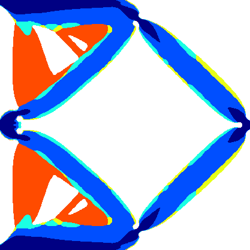

# Summary

Topology optimization (TO) solves a partial differential equation (PDE)-constrained optimization problem to determine the optimal distribution of single or multiple materials for maximizing structural performance under given design space and constraints. [@bendsoe2013topology] `DVTopMultiCuts` provides a MATLAB implementation for TO with multiple materials and linear elasticity in arbitrary 2D rectangular domains, by maintaining discrete design variables and deploying a multi-cuts formulation as introduced in [@ye2024discrete]. This software supports both convex objectives, such as minimum compliance (see \autoref{fig:topo_mc}),and non-convex objectives, such as compliant mechanism design (see \autoref{fig:topo_cm}).

{ width=40% }

{ width=40% }

# Statement of need

First, existing open-source TO codes (educational [@andreassen2011efficient] or scalable [@aage2015topology]) typically rely on the Solid Isotropic Material with Penalty (SIMP) method [@bendsoe1999material]. Next, these existing implementations often lack user-friendly interfaces to accommodate different boundary conditions (BCs) and multi-material designs, as well as regular maintenance and updated test cases, hindering benchmarking between different implementations. Unlike existing software, `DVTopMultiCuts` provides a user-friendly interface that simplifies the addition of new BCs for benchmarking purposes. In addition, two types of objectives are integrated in the software: minimum compliance and compliant mechanism. Four types of BCs for minimum compliance and one for compliant mechanisms are currently defined in BCs.m. Users can easily add new BCs by modifying this file.

Furthermore, the multi-cuts formulation, while first introduced to TO problems in truss systems [@munoz2011generalized], has received limited attention over the past decade, due to its implementation complexity. However, as demonstrated in our recent work [@ye2024discrete], the multi-cuts formulation reduces optimization iterations and thereby PDE solver calls (e.g., finite element analysis (FEA)) by approximately an order of magnitude compared to the conventional SIMP method.  Recognizing the significant computational expense associated with each FEA evaluation [@aage2015topology], the multi-cuts formulation offers a promising avenue for enhancing the computational efficiency of TO designs in practical applications. Addressing a gap in existing software, `DVTopMultiCuts` is, to the authors' knowledge, the first open-source implementation of the multi-cuts formulation for solving TO problems, specifically focusing on continuum structure design with high-resolution meshes.

# Technical details

`MultiCutsTopOpt.m` controls the procedure in the entire optimization. It generates and moves between multiple stages with different minimum Young's moduli $E_0$ and total masses $\bar{M}$ of the structure to control the conditioning in optimization until reaching the target total mass of the problem. It also updates the radius of the trust region by calling `UpdateTrustRegion.m`. It accumulates all cuts generated within a single stage and decides the stopping of each optimization stage according to the difference between the upper bound $U$ obtained from FEA and upper bound estimation $\eta$ obtained by solving the derived mixed integer linear programmings (MILPs) generated by combining multiple cuts together.

`MultiCuts.m` implements the branch and cut strategy to select the proper cuts $\mathcal{P}_s$ and solves the following MILP:
\begin{equation}
    \begin{aligned}
        \min_{\rho, \eta} & \quad \eta \\
        \text{s.t.} & \quad \tilde{f}^j(\rho) \leq \eta, \quad \forall j \in \mathcal{P}_s \\
        & \quad t^j(\rho) \leq d^j, \quad \forall j \in \mathcal{P}_s \\
        & \quad H_{i_H}(\rho) \leq 0, \quad i_H = 1, \dots, n_H \\
        & \quad \rho \in \{0, 1\}^{n_e} \;.
    \end{aligned}
    \label{eq:branched_multi-cut}
\end{equation}
where $\rho$ is the design variable, $\tilde{f}^j(\rho)$ is the linear approximation to the objective obtained from sensitivity analysis, $t^j(\rho)$ is the trust region constraint, $d^j$ is the radius of the trust region and $H_{i_H}$ denotes extra linear constraints included in TO. It maintains the solution history within a given optimization stage and transverse any possible combination of cuts generated in the stage.

Two filters, radius filter and PDE filter [@lazarov2011filters], have been provided in the software in `RadiusFilter.m` and `PDEFilter.m`, respectively. Different materials are rendered in different colors at the visualization stage and the color map can be modified in `Visualize.m`. `Objective.m` defines the supported objectives in `TopMultiCuts`. It requires the elementary matrix generated from `ElementMat.m`. To add new physics needs to modify these two files together. The sensitivity analysis is performed in `Sensitivity.m`. One can try new sensitivity analysis strategy for discrete variable TO by modifying this file.

The scripts in `Benchmark` give examples on setting the parameters to initialize the optimization. Arbitrary number of candidate materials with different Young's moduli $E$ can be assigned to `params`. Different objectives and BCs can be selected by assigning `params.BC` and `params.objective` with different values. The discretization resolution of the design domain is controlled by `params.nelx` and `params.nely`. Running the scripts, the optimal material layout would be stored to `Result` once the optimization is finalized.

# Outlook

The multi-cuts formulation with discrete design variables has also enabled the development of sub-problems suitable for quantum computing acceleration, as demonstrated for minimum compliance TO design [@ye2023quantum]. `DVTopMultiCuts` represents a key step towards extending quantum-accelerated TO solvers to large-scale 3D problems and complex multi-physics objectives (e.g., [@kumar2020topology]) in the future. 

# Installation instructions

`TopMultiCuts` is a MATLAB software and requires Gurobi [@gurobi] as the external library when solving MILPs. Gurobi is a commercial library with MATLAB interface and can be accessed via [academic license](https://www.gurobi.com/academia/academic-program-and-licenses/) for free.

# Acknowledgements

We acknowledge the support for this work from the University of Wisconsin-Madison Office of the Vice Chancellor for Research and Graduate Education, with funding from the Wisconsin Alumni Research Foundation.

# References